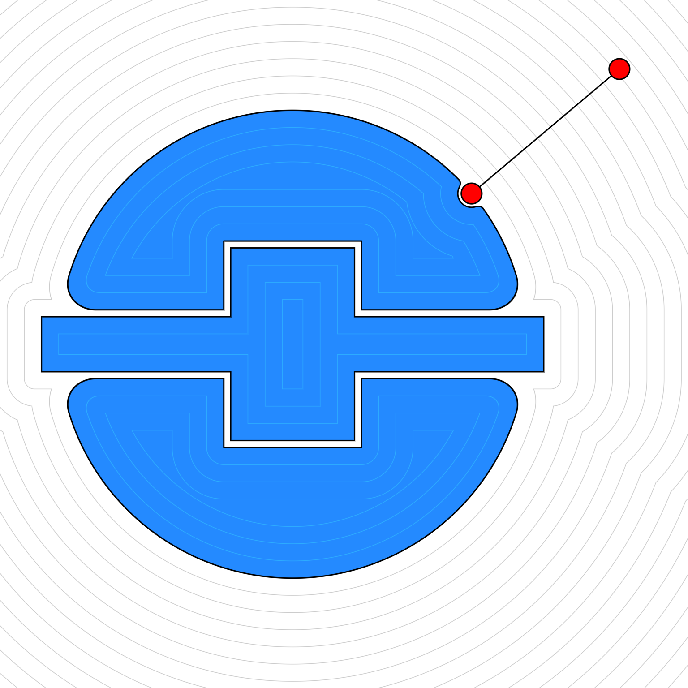

# Simple experiment for a little utility to draw diagrams of SDFs

A Python experiment for generating diagrams using Signed Distance Fields (SDFs) with GPU-accelerated rendering via Rust and wgpu. The goal is to provide useful functions so that not everything has to be done in a shader.


*Note: This is a WIP. Some functions might not be fully implemented yet.*



---
### Requirements (the interesting ones):
- [Rust](https://www.rust-lang.org/)
- [Python](https://www.python.org/)
- [wgpu](https://github.com/gfx-rs/wgpu)
- [Maturin (pyo3)](https://github.com/PyO3/maturin) for Python <> Rust bindings

*not tested with different python/rust/wgpu versions or different machines yet. This was python 3.12 on an M3 Pro MacBook Pro*

---
### Instructions to Build:

From `/renderer`:

```
maturin develop --release
```

To run (from root):

```
python -m demos.demo1
```

Sample shape:

```python
canvas = Canvas(1024)

c = Circle(Point(0.125, 0.125), 0.125)
b = Box(Point(0, 0), 0.25, 0.25)
result = c | b

canvas.draw_sdf(result)
canvas.img.save("output_image.png")
canvas.img.show()
```


This produces:


*Colors can also be set in `Canvas.settings`. Bounding boxes can be overlaid on top of the image with `canvas.draw_bounds(result)`. I'm also working on some more overlay functions that aren't rendered as SDFs*


Boolean operations are done with the functions in `sdf_core.py`. For example, `union(a, b)` or `round_difference(a, b, 0.05)`. There's also some handy shorthand available:

| Function         | Shorthand Syntax |
|------------------|:--------------:|
| `union(a, b)`    | `a \| b`   |
| `intersection(a, b)` | `a & b`    |
| `difference(a, b)`   | `a & -b`    |

*Sharp cases only. For rounded versions, use the function directly, e.g. `round_difference(a, b, 0.05)`.*

---
### How it works

1. Geometry is set up with python functions using SDF classes along with helpful functions. These produce a simple AST.
2. Additional functions (class methods, utilities, or other python ones) can be used to construct the geometry. This means not all computation has to be done on the GPU later in the shader. For example, a gradient can be queried once during setup (see the main example).
3. The AST is transpiled to wgsl code. That code is then spliced into a wgpu compute shader and then rendered to an image. The wgpu side is handled by rust, using pyo3.

This is what Python produces and sends to wgpu for example in the main image at the top:

```
min(min(min(min(roundDifference(roundDifference(circle(p,vec2<f32>(-0.1000,-0.0750),0.3400),min(box(p-vec2<f32>(-0.1000,-0.0750),vec2<f32>(0.2000,0.3000)),box(p-vec2<f32>(-0.1000,-0.0750),vec2<f32>(0.7500,0.1000))), 0.05),circle(p,vec2<f32>(0.1720,0.1290),0.0200), 0.0075),circle(p,vec2<f32>(0.1720,0.1290),0.0100)),circle(p,vec2<f32>(0.4000,0.3000),0.0100)),line(p,vec2<f32>(0.4000,0.3000),vec2<f32>(0.1720,0.1290))),min(box(p-vec2<f32>(-0.1000,-0.0750),vec2<f32>(0.2000,0.3000)),box(p-vec2<f32>(-0.1000,-0.0750),vec2<f32>(0.7500,0.1000)))+0.01)
```

You'll notice that there's some low level stuff like `max()` and some higher level stuff like `circle()`. This is because I just wrote the higher level functions in the shader and wgpu optimizes the abstraction away anyway. Much easier to debug this way.

Why GPU, not CPU?
- It was easier to get really fast performance on the GPU rather than coming up with a more advanced CPU evaluator (see the link below).
- The wgpu setup is super fast. Time to generate the main image, including GPU setup, is around 75ms on my Macbook. Writing the .png takes another ~300ms. I also plan on using this to create image sequences, which would allow reuse of the initial GPU setup.
- I might extend this to create 3D rendering or support some marching cubes meshing. Having the gpu ready will help there. This is also why I used a compute shader rather than a fragment shader.
- I like wgpu and wanted to play with it more

It does *not* do any sort of [clever optimization](https://www.mattkeeter.com/research/mpr/) for sdfs specifically. But, since it's purely to create simple images (and it's in a gpu shader anyway), performance doesn't really matter. The first image took ~400ms, including writing the .png to disk, at 1024x1024. I haven't measured anything more.

---
### Debugging

Finally, there's also a .json debug output function available on any `SDF` class that lets you inspect the tree of operations (`result.write_json(output_path.json)`). For the second image above (the square + circle), here is the .json output:

```json
{
  "op": "union",
  "left": {
    "type": "Circle",
    "center": "(0.125,0.125)",
    "radius": 0.125
  },
  "right": {
    "type": "Box",
    "center": "(0,0)",
    "width": 0.25,
    "height": 0.25,
    "min_point": "(-0.125, -0.125)",
    "max_point": "(0.125, 0.125)"
  }
}
```
---
*I also tried using [Cursor](https://www.cursor.com) a bit for this project. I defined all the base functionality, then used Cursor to help me reorganize it into a module (change folder structure, manage relative imports, etc. Pretty interesting.)*
